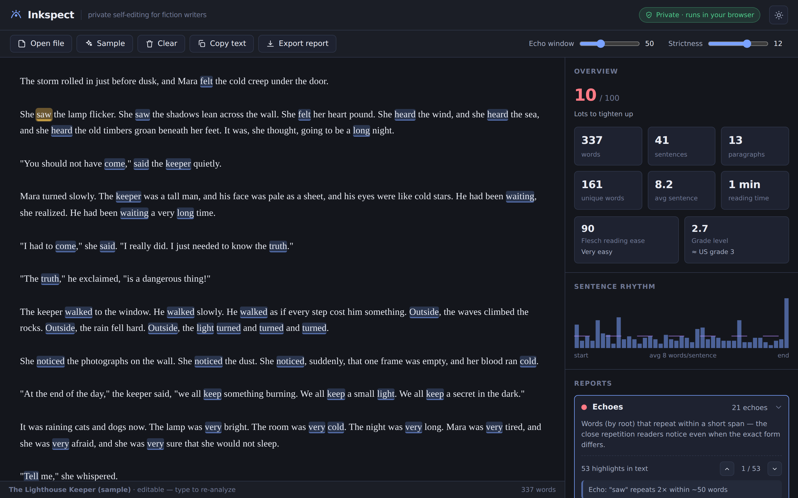

<div align="center">

# Inkspect

### A private, in-browser self-editing lens for fiction writers

Find the prose problems free tools ignore — **echoes**, **crutch & filler words**,
reader-distancing **filter words**, **adverb** and **weak-verb** overuse,
**clichés**, **said-bookisms**, and **sentence-rhythm** flatlines — all computed
**100% in your browser**. Your unpublished draft never touches a server.

</div>



## Why Inkspect exists

Good self-editing means catching what you can't see on a re-read: the word you
used three times in two sentences, the *just / really / suddenly* crutches, the
*she saw / he felt / I noticed* filter verbs that hold readers at arm's length,
the wall of same-length sentences that flattens your pacing.

These are mechanical, detectable problems — but the tools that detect them well
(**ProWritingAid's "Echoes"**, **Grammarly Premium**) are **paid**, and the free
options only do a fraction: word-frequency counters just rank words; Hemingway is
general-purpose and knows nothing about *fiction* craft. Writers are also
(rightly) wary of pasting an unpublished manuscript into a cloud service.

Inkspect fills that gap: the fiction-specific reports, free, and **fully local**.

## Features

| Report | What it finds |
|---|---|
| **Echoes** | The same word *root* repeated within a short window (e.g. `walked`…`walking`) — close repetition readers notice. Stemmed, stopword-aware, adjustable window. |
| **Repeated phrases** | Exact 3–5 word phrases reused across the manuscript. |
| **Crutch & filler words** | `just`, `really`, `very`, `suddenly`, `kind of`… with counts and density per 1,000 words. |
| **Filter words** | `saw`, `heard`, `felt`, `knew`, `realized`, `noticed`… that distance the reader. |
| **Adverbs (-ly)** | All `-ly` adverbs (minus a non-adverb allowlist), with extra emphasis on adverbs glued to dialogue tags (`said quietly`). |
| **Weak verbs & passive** | "To be" density plus a passive-voice heuristic. |
| **Dialogue tags** | Plain `said`/`asked` vs. ornate "said-bookisms" (`exclaimed`, `hissed`, `retorted`). |
| **Clichés** | A curated dictionary of worn-out stock phrases. |
| **Sentence rhythm** | Per-sentence length chart + flags for monotonous runs that flatten pacing. |
| **Overused words** | Document-wide frequency, grouped by root. |
| **Readability** | Flesch Reading Ease, Flesch–Kincaid grade, word/sentence/paragraph/syllable stats, reading time, and an at-a-glance polish score. |

Plus: click any finding to **scroll to and highlight** it in the text; the editor
is **live** (edit and re-analyze); **light/dark** themes; **`.txt` / `.md` / Word
`.docx`** import; and a one-click **Markdown report export**.

## Privacy

Inkspect makes **zero network requests at runtime**. Your manuscript is read,
analyzed, and highlighted entirely in your browser. Nothing is uploaded, logged,
or stored anywhere but your own machine (text is cached in your browser's
`localStorage` only, so a refresh doesn't lose your work). You can verify this in
your browser's Network tab — it stays empty.

## Quick start

```bash
git clone https://github.com/<your-username>/inkspect.git
cd inkspect
npm install
npm run dev          # http://localhost:5173
```

### Use a release build (no toolchain)

1. Download `inkspect-<version>-web.zip` from the [Releases](../../releases) page.
2. Unzip it and serve the folder over HTTP (a static site — opening `index.html`
   directly via `file://` won't work because browsers block module workers there):

```bash
npx serve inkspect-1.0.0-web      # or: python3 -m http.server
```

3. Open the printed URL. Click **Load sample manuscript** to see it in action, or
   open your own file.

## Usage

- **Bring text in:** paste into the editor, click **Open file** (`.txt`, `.md`,
  `.docx`), or **Sample** to load the demo manuscript.
- **Read the dashboard:** word/sentence stats, readability, the sentence-rhythm
  chart, and the polish score update automatically.
- **Investigate a report:** click it to expand. Its hits are highlighted in the
  text; use the ▲/▼ buttons to jump between them.
- **Tune sensitivity:** adjust the **Echo window** (how close counts as an echo)
  and **Strictness** (crutch/filter density threshold) in the toolbar.
- **Export:** **Export report** downloads a Markdown summary; **Copy text** copies
  the current manuscript.

## Scripts

| Command | Does |
|---|---|
| `npm run dev` | Start the Vite dev server. |
| `npm run build` | Type-check and build the static site into `dist/`. |
| `npm test` | Run the Vitest engine + importer suite. |
| `npm run lint` | ESLint (zero warnings allowed). |
| `npm run package` | Build the release zip + checksums into `artifacts/`. |

## How it works

The analysis lives in `src/engine/` as a **pure, dependency-free TypeScript
library** — `analyze(text, options) → AnalysisResult`. It tokenizes once
(carrying exact character offsets so every finding can be highlighted), segments
sentences/paragraphs, then runs each analyzer. The React UI runs the engine in a
**Web Worker** so even a full novel never freezes the page. See
[`ARCHITECTURE.md`](ARCHITECTURE.md).

## Limitations

- **English only** in v1 (the craft word-lists and heuristics are English).
- It is **not** a grammar or spell checker, and does no AI rewriting — by design.
- Heuristics are approximate: the stemmer is light, the passive-voice and
  syllable detectors are rule-based. Treat reports as a guide, not a grader.
- `.doc` (legacy) and `.pdf` import are out of scope; export to `.docx`/`.txt`.

## Tech

TypeScript · React 18 · Vite 5 · Vitest · a Web Worker · mammoth (for `.docx`) ·
hand-written CSS. All dependencies are MIT/Apache-2.0.

## License

[MIT](LICENSE) © Inkspect contributors.
